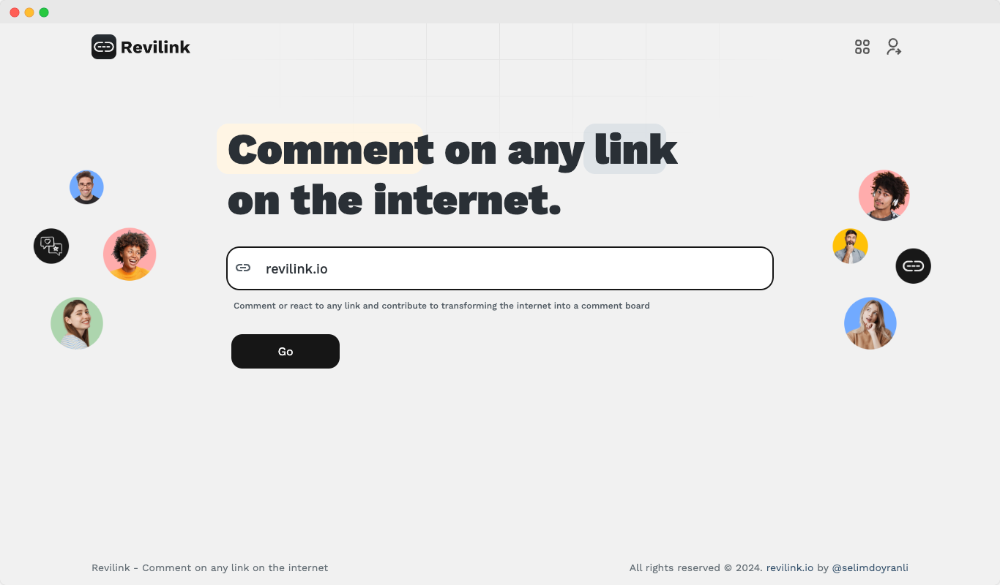

[![changelog][changelog-src]][changelog-href]
[![License][license-src]][license-href]

<br>
<p align="center">
<a href="https://revilink.io" target="_blank">

</a>
</p>

<p align="center">
<b>Revilink</b>
</p>

<p align="center">
Comment on any link on the internet
</p>

<br>

<p align="center">
  <a href="https://revilink.io" target="_blank"> 
    
  </a>
</p>

<p align="center">
<a href="https://github.com/revilink/revilink" target="__blank"></a>
</p>

<p align="center">
  <a href="https://revilink.io" target="_blank">Website</a>
</p>

<div align="center">
<sub>Buy me a coffee - <a href="https://www.buymeacoffee.com/selimdoyranli">Sponsorship 💖</a></sub><br>
<sub>Github Sponsors - <a href="https://github.com/sponsors/selimdoyranli">Sponsorship 💖</a></sub><br>
</div>

## Getting Started

### Try it Online ⚡️

[revilink.io](https://revilink.io)

### Init Project Locally

Install [Node.js >=18.0.0](https://nodejs.org/) and run the following command:

#### Installation

Git clone.

```bash
$ git clone https://github.com/revilink/revilink.git
```

&nbsp;

#### Build Setup

```bash
$ cd revilink

# install dependencies
$ yarn install

# serve with hot reload at localhost:3000
$ yarn dev

# generate static project
$ yarn generate

# serve production mode
$ yarn start

```

#### Linter

```bash
# run eslint
yarn lint:eslint

# run eslint fix
yarn lint:eslint:fix

# run stylelint
yarn lint:stylelint

# run stylelint fix
yarn lint:stylelint:fix

# run prettier
yarn prettier
```

#### Git
Using [Conventional Commits](https://www.conventionalcommits.org), commitizen, commitizen cli

```bash
# add files
git add .

# generate commit message
yarn commit # or yarn cz

# push
git push
```

#### Release & Changelog
Using [changelogen](https://github.com/unjs/changelogen) for release & changelog management, arguments are the same as changelogen

```bash
# run changelogen
yarn changelog
```

---

## Tech Stack

- [Nuxt](https://nuxtjs.org) - Nuxt2 vue framework
- [@nuxtjs/composition-api](https://composition-api.nuxtjs.org) - Composition api module for nuxt2 / vue2
- [Vuesax](https://vuesax.com) - UI library
- Pug
- Scss
- Bootstrap5 scss utils
- Husky
- Eslint
- Stylelint
- Prettier
- Commitlint
- Commitizen
- Changelogen

## Related Repos

[revilink-webext](https://github.com/revilink/revilink-webext)
[revilink-backend](https://github.com/revilink/revilink-backend)

## Sponsorship

You can sponsor me for the continuity of my projects:

<p align="left">
  <a href="https://buymeacoffee.com/selimdoyranli">
    
  </a>
</p>

## License

MIT License © 2024 [Revilink](https://github.com/revilink)


<!-- Badges -->
[changelog-src]: https://img.shields.io/static/v1?label=%F0%9F%93%96&message=Release%20Notes%20|%20CHANGELOG&color=blue
[changelog-href]: ./CHANGELOG.md

[license-src]: https://img.shields.io/badge/License-MIT-blue.svg
[license-href]: ./LICENSE
